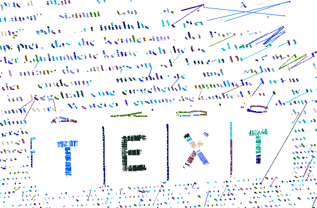

# Stroke Width Transform

A test implementation of the Stroke Width Transform algorithm.

## Example

To run SWT with connected components against the `text.jpg` example image, execute

```bash
python main.py images/text.jpg
```

Given the following image ...


... it will show these connected components (brightness by ID):



## Conda environment

A conda environment is available in `environment.yaml`. To create and activate it, run

```bash
conda env create -f environment.yaml
conda activate swt
```
